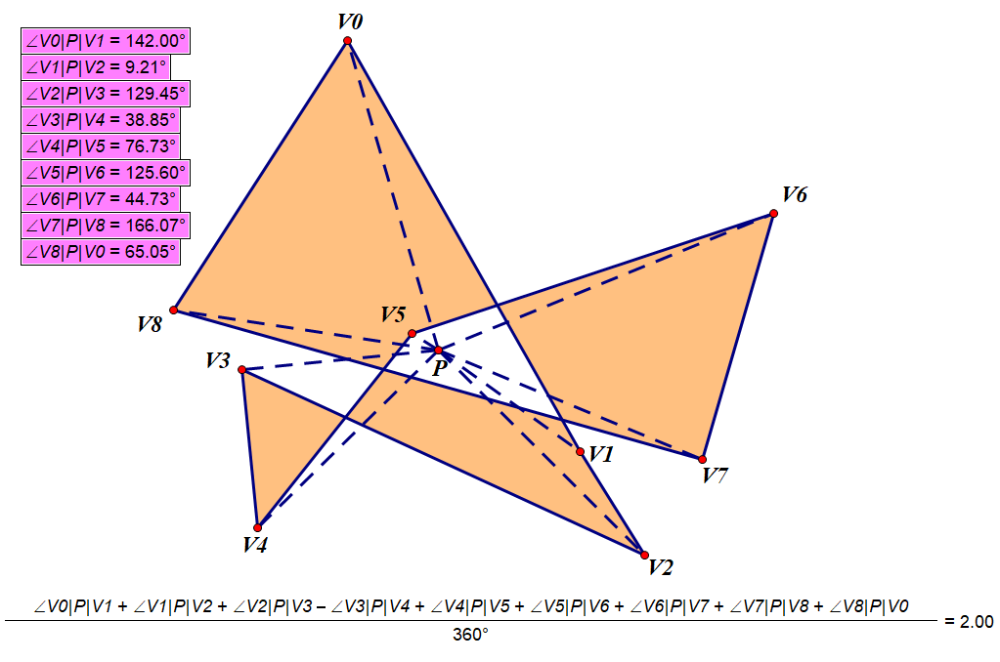
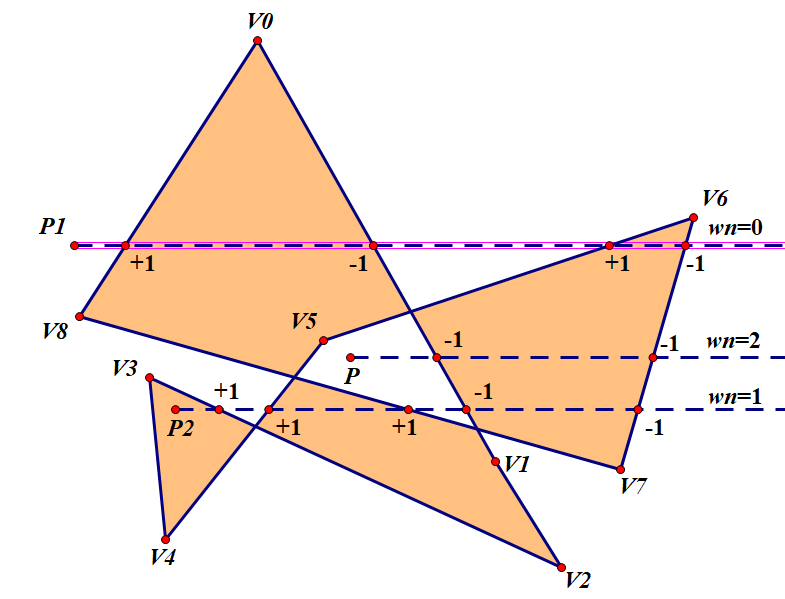
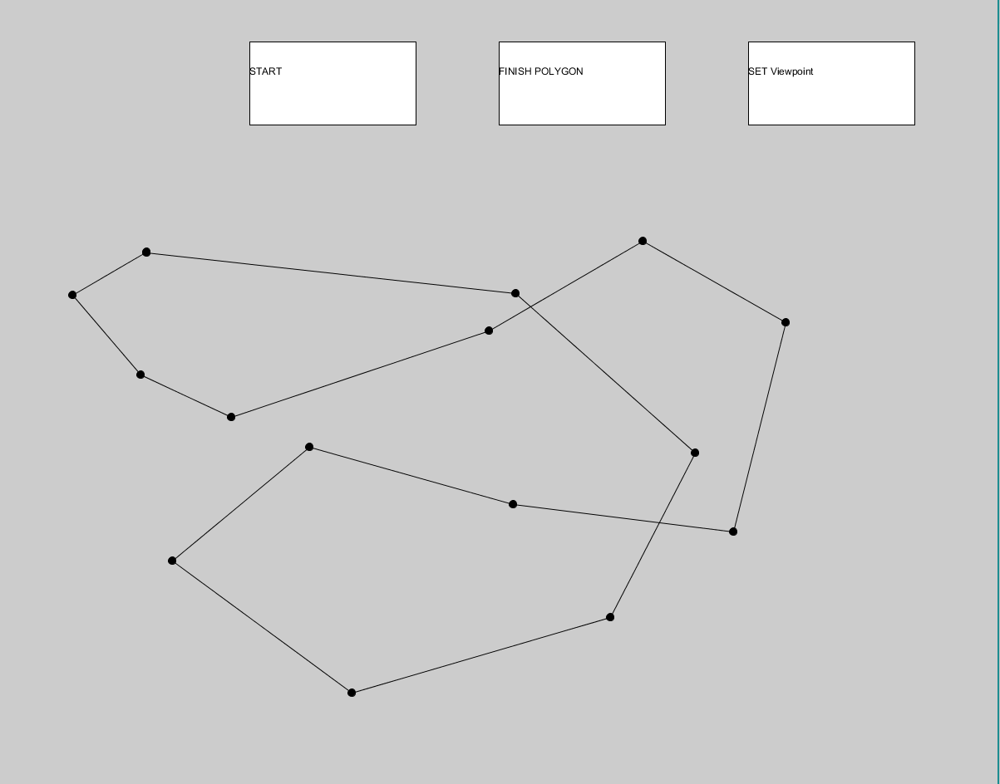

#  Winding-Polygons

## Course project for CG 2017

## Topic:
Winding-Polygons - Show how to compute winding numbers of polygonal curve

### Description:
Winding number:
In mathematics, the winding number of a closed curve in the plane around a given point is an integer representing the total number of times that curve travels counterclockwise around the point. The winding number depends on the orientation of the curve, and is negative if the curve travels around the point clockwise.

### Processure:
1. get a polygon
2. set a point
3. calculate the winding number

## Group member:

* Qi Zhang : qi.3.zhang@uconn.edu
* Yufan Zhang : yufan.zhang@uconn.edu
* Yenhsiang Lai : yen-hsiang.lai@uconn.edu
* Shaoyan He : shaoyan.he@uconn.edu

## Tools:
* html p5.js and some other js library

* Processing

## Algorithm we will use
* method 1: a basic method:
the viewpoint is p and the start point of polygon is s, from s to the next vertex of the polygon,
if the angle is cw the angle will be positive and if ccw the angle will be negative, we will calculate abs(the sum of angles/360) when we pass all the vertex.(just like the graph below)

* method 2: an advance method:
the viewpoint is p and we will generate a horizontal ray from this point and it have some intersection with the ray
we will test each segment of polygon whether intersecting with the ray with the clock wise and give every segment a direction,
According to the ray, if the segment is from up to down we denote it as -1,  from up to down we denote it as 1, then calculate the sum of all intersecting segments.

## how to use (This is an original version)
* 1st step:
People will use mouse to locate the point in canvas, and the program will generate the line between the node automatically, When people push the Finish Polygon button, the program will generate the segment between the first and the last point.  
* 2nd step:
People will set up the viewpoint after push the viewpoint button.
* 3rd step:
People push the Start button to start calculate the winding number.

## view online:
http://htmlpreview.github.io/?https://github.com/ZQlalala/Winding-Polygons/blob/master/index.html
